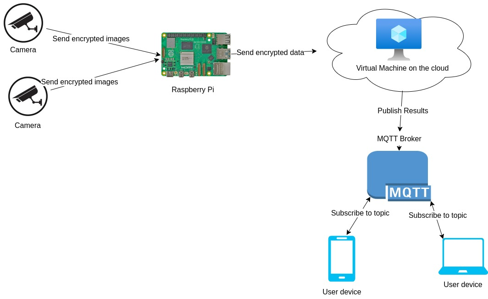

# About

This project is a exposed end point API that allow other parties to develop their own clients on top of it; this API should provide the following:

- 2D pose estimated keypoints.
- 3D pose estimated keypoints.
- Feedback about the pose and how to improve it.

The goal of this project is _to provide a **cheap** and **reliablve** feedback that helps improving the addressed skill on the addressed sport_

# How?
## This project works

This project exposes an API end point based on the MQTT protocol that can be used to develop sports (for now, it's only some yoga poses) related applications; it first takes a video/image input from the client side, do some preprocessing on the edge, and then send it to a VPS on the cloud where it gets evaluated and processed to extract meaningful information and construct a reliable 'feedback', lastly it published it's results on a predefined MQTT broker on a predefined topics that other clients can subscribe.

## Setup this project

To make use this project on your own, you need to have:
* Client: This is used to stream image/video to the aggregator, this can be any device that communicate over HTTP.
* Aggregator: This is where some preprocessing will happen, and then send the image/video as well as the processed data to a VPS on the cloud, in the case of this project, we've used a [Raspberry Pi 5](https://www.raspberrypi.com/products/raspberry-pi-5/) that is connected to the internet.
* VPS/Server: This is used to do some heavy processing, extract meaningful information from the provided data, construct a feedback and then publish the results to the MQTT broker, we've used a VPS created on [Azure cloud](https://azure.microsoft.com/en-us).

After having equipements ready, we need to get [Nix](https://nixos.org/) installed on each one of them as well as enabling [Flakes](https://nixos.wiki/wiki/flakes), getting that ready, now copy each folder on the respective device following the bellow table and then follow the `GUIDE.md` under each folder

|folde      |device      |
|-----------|------------|
|/aggregator|*Aggregator*|
|/client    |*Client*    |
|/server    |*VPS/Server*|

